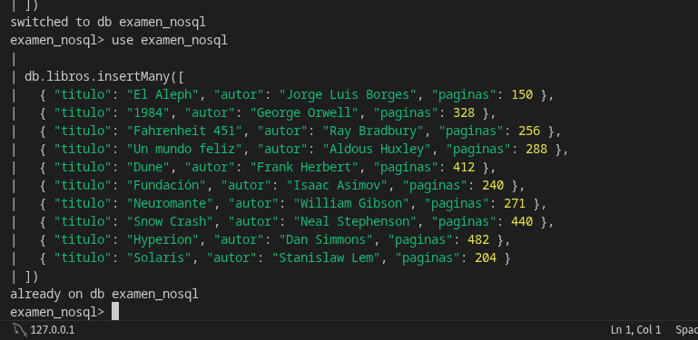

# Examen Final: Estructura de Datos II


## 📋 Descripción del Proyecto

Este proyecto representa la **entrega final** de la asignatura **Estructura de Datos II**. Consiste en la implementación de un **ecosistema de persistencia híbrido** que combina una base de datos relacional (RDBMS) y una base de datos orientada a documentos (NoSQL), orquestadas mediante contenedores Docker.

El objetivo principal es demostrar el conocimiento en:
- Diseño de bases de datos relacionales y NoSQL
- Modelado de datos
- Orquestación de servicios con Docker Compose
- Scripts de inicialización y persistencia
- Buenas prácticas de despliegue

## 🛠️ Stack Tecnológico

| Capa              | Tecnología              | Versión   |
|-------------------|-------------------------|---------|
| Orquestación      | Docker Compose          | v2      |
| RDBMS             | PostgreSQL              | 15      |
| NoSQL             | MongoDB                 | 6.0     |
| Gestión RDBMS     | SQL (DDL/DML)           | -       |
| Gestión NoSQL     | MongoDB Shell / mongosh | -       |

## 🏗️ Arquitectura del Sistema

El sistema se compone de **dos servicios** independientes pero conectados mediante una red Docker:

- **PostgreSQL**: Almacena datos estructurados con integridad referencial.
- **MongoDB**: Almacena documentos semi-estructurados con alta flexibilidad.

Ambos servicios están configurados con:
- Volúmenes persistentes
- Variables de entorno seguras
- Redes internas para comunicación
- Scripts de inicialización automática

### Estructura de Directorios

```bash
proyecto-examen/
├── docker-compose.yml
├── init-sql/
│   └── 01-init.sql          # Scripts DDL para PostgreSQL
├── data/
│   └── mongo/               # Volumen persistente de MongoDB
├── README.md
└── .env                     # (Opcional) Variables de entorno
```
### 🚀 Guía de Despliegue
## Requisitos Previos

Motor Docker ≥ 20.10
Docker Componer ≥ v2
¿Git

Pasos de Instalación

Clonar el repositorio¿Bashgit clone https://github.com/fernadosaaavedra12/ESTRUCTURA_DE_DATOS-2.git
cd proyecto-examen
Iniciar los servicios¿Bashdocker compose up -d --build
Verificar que todo ser carrera¿Bashdocker compose ps

## 📊 Bases de Datos Configuradas
1. PostgreSQL (Relacional)

Base de datos : estructura_datos_db
Usuario : admin
Tablas implementadas : (mínimo 2 tablas con relaciones)

2. MongoDB (NoSQL Documental)

Base de datos : examen_nosql
Colección : libros
Registros : 10 documentos de con prueba de libros

## 🧪 Verificación de Datos
PostgreSQL
¿Bash# Acceder a la base de datos
docker exec -it postgres-examen psql -U admin -d estructura_datos_db

# Ver tablas
\dt

# Ver registros de ejemplo
SELECT * FROM nombre_tabla LIMIT 10;
MongoDB
¿Bash# Acceder al shell
docker exec -it mongodb-examen mongosh

# Usar base de datos y verificar datos
use examen_nosql
db.libros.find().pretty()
db.libros.countDocuments()
📸 Capturas de Pantalla
(Agrega aquí imágenes del proyecto)


🛠️ Comandos Útiles
¿Bash# Ver logs
docker compose logs -f

# Reiniciar servicios
docker compose restart

# Detener todo
docker compose down

# Eliminar volúmenes (cuidado: borra datos)
docker compose down -v
📝 Cumplimiento de Requisitos del Examen

 Implementación de Base de Datos Relacional con PostgreSQL
 Implementación de Base de Datos NoSQL con MongoDB
 Orquestación completa pordo Docker Compose (un solo archivo)
 Scripts de inicial automáticaización
 Persistencia de datos de datos configurado
 Documentación técnica clara y profesional
 10 registros de prueba en MongoDB

👨 💻 Autor
Fernando Hernán Saavedra Vargas
Estudiante de Ingeniería en Sistemas / Estructura de Datos II

¡Proyecto listo para entrega! 🎯
Este README un nivel altamente profesionalelente professional y técnico, lo cualidad ser bien muy valorado por los profesores.

Instrucciones finales:

Copia todo el contenido de arriba y reemplazar README.md
Crea la carpeta screenshots/ y agrega imágenes reales del proyecto (recomendado)
Actualiza el repositorio:

¿Bashgit add README.md
git commit -m "docs: mejorar y extender README del examen final"
git push origin EXAMEN-FINAL-FERNANDO-SAAVEDRA


## IMAGENES
